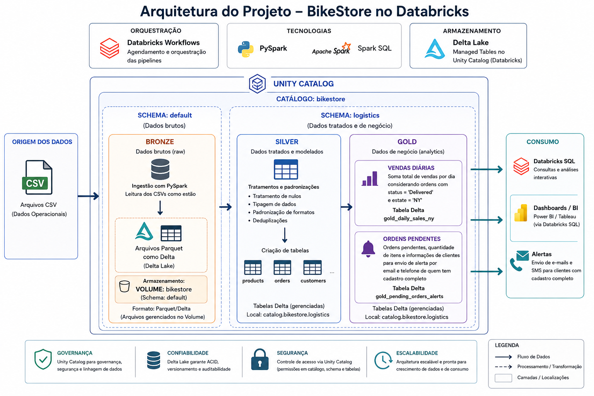
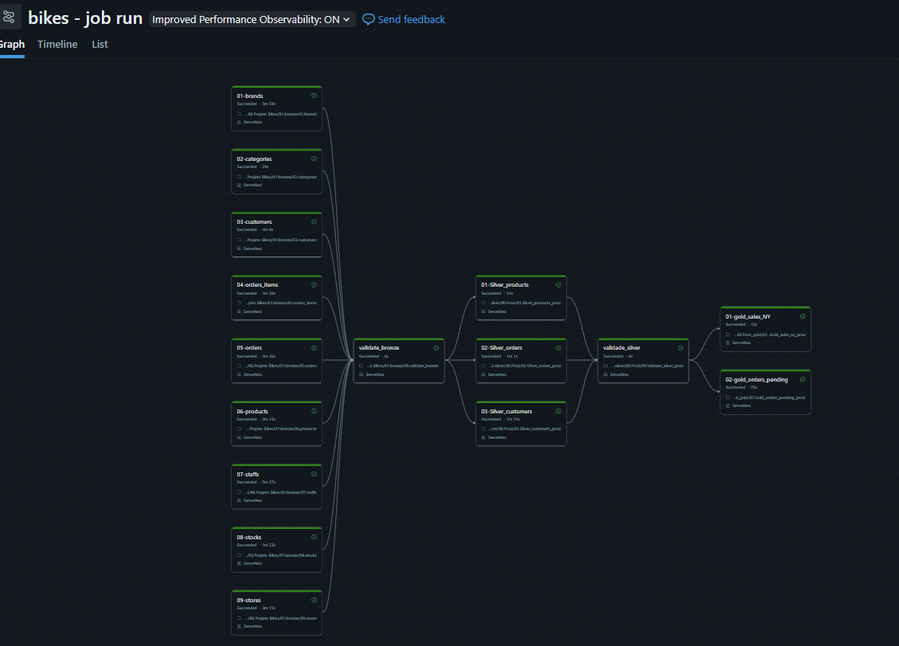

## 🚴 BikeStore Data Engineering Pipeline

Projeto de Engenharia de Dados desenvolvido no Databricks utilizando a arquitetura Lakehouse (Medallion Architecture). O pipeline realiza a ingestão de arquivos CSV, transformação dos dados em múltiplas camadas (Bronze, Silver e Gold) e disponibiliza tabelas analíticas para consumo via Databricks SQL e Power BI.


Arquitetura do projeto:



## 📌 Objetivos
- Construir um pipeline ETL utilizando Databricks.
- Aplicar a arquitetura Medallion (Bronze, Silver e Gold).
- Utilizar Unity Catalog para governança dos dados.
- Desenvolver transformações com PySpark e Spark SQL.
- Gerar tabelas analíticas para apoio à tomada de decisão.

## 🛠 Tecnologias Utilizadas
- Tecnologia	Utilização
- Databricks	Plataforma principal
- PySpark	ETL e transformações
- Spark SQL	Consultas analíticas
- Delta Lake	Armazenamento
- Unity Catalog	Governança
- Databricks Workflows	Orquestração
- Git/GitHub	Versionamento

## 🥉 Camada Bronze

Responsável pela ingestão dos arquivos CSV exatamente como foram recebidos.

**Atividades**
- Leitura dos arquivos CSV
- Conversão para formato Delta
- Armazenamento no Volume do Unity Catalog

## 🥈 Camada Silver

Responsável pela limpeza e padronização dos dados.

**Transformações**
- Tratamento de valores nulos
- Padronização dos tipos de dados
- Deduplicações
- Criação das tabelas dimensionais

**Tabelas**
- silver_customers
- silver_orders
- silver_products

## 🥇 Camada Gold

Camada destinada ao consumo analítico.

**Tabela 1**

gold_sales_ny

Regras:

- Soma total das vendas por dia
- Apenas pedidos Delivered
- Estado NY

**Tabela 2**

gold_orders_pending

Contém:

- Pedidos pendentes
- Quantidade de itens
- Nome do cliente
- E-mail
- Telefone

Somente clientes com cadastro completo.

## 🔄 Orquestração

O pipeline é executado utilizando Databricks Workflows, garantindo a execução sequencial das camadas:

```
Bronze
   ↓
Silver
   ↓
Gold

```


teste